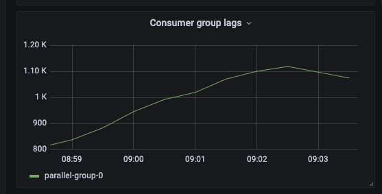
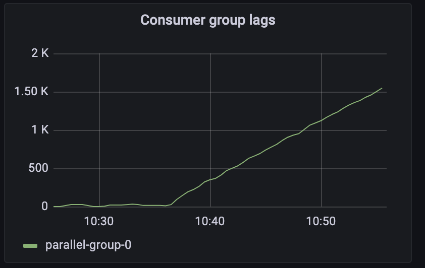
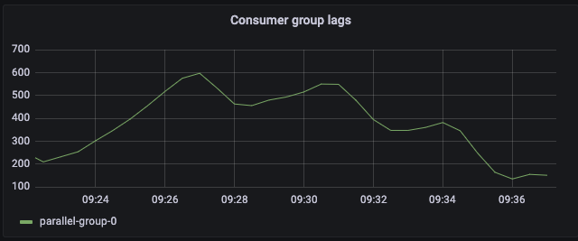

Kafka Parallel Consumer Examples
--------------------------------
To run the code examples you should modify the [AppConfig.java](https://github.com/aiven/aiven-examples/blob/parallel-consumer-examples/kafka/parallel-consumer-examples/src/main/java/io/aiven/config/AppConfig.java)
file with your cluster Urls and path to credentials.
```shell
public static String BOOTSTRAP_SERVERS          = "";
public static String SCHEMA_REGISTRY_URL        = "";
public static String CREDENTIALS_SOURCE         = "USER_INFO";
public static String AUTH_USER_INFO             = "";
public static String CREDENTIALS_PATH           = ROOT_PATH + "/Documents/temp/credentials";
```

Along with that you can also configure the following options:
```shell
public static int totalConsumerThreads  = 3;      // how many consumer will run; By defaults consumes from a 3-partition topic so 3 is the default.
public static int messagesPerSecond     = 16;     // number of messages to generate per second
public static int totalMessagesToSent   = 10000;  // how many messages to sent in total
public static int keyspaceSizeLower     = 1;      // the lower bound for the keyspace
public static int keyspaceSizeUpper     = 100;    // the upper bound for the keyspace
public static int payloadSize           = 400;    // message size in bytes
```

Build the executable jar file, by running:
```shell
./gradlew jar
```

Open two different terminals and start one consuming app first and then one producing. 
```
java -cp build/libs/parallel-consumer-examples-0.1.0.jar io.aiven.consumers.DataConsumer
java -cp build/libs/parallel-consumer-examples-0.1.0.jar io.aiven.producers.SampleDataProducer
```

```shell
10:32:29.415 INFO  [pc-pool-3-thread-412] io.aiven.consumers.ConsumerThread - [Consumer-0]: Batch contains '1' records. Total messages processed so far 411
10:32:29.792 INFO  [pc-pool-3-thread-413] io.aiven.consumers.ConsumerThread - [Consumer-0]: Batch contains '1' records. Total messages processed so far 412
10:32:30.109 INFO  [pc-pool-3-thread-414] io.aiven.consumers.ConsumerThread - [Consumer-0]: Batch contains '1' records. Total messages processed so far 413
10:32:30.230 INFO  [pc-pool-3-thread-415] io.aiven.consumers.ConsumerThread - [Consumer-0]: Batch contains '1' records. Total messages processed so far 414
10:32:30.627 INFO  [pc-pool-3-thread-416] io.aiven.consumers.ConsumerThread - [Consumer-0]: Batch contains '1' records. Total messages processed so far 415
10:32:30.877 INFO  [pc-pool-3-thread-417] io.aiven.consumers.ConsumerThread - [Consumer-0]: Batch contains '1' records. Total messages processed so far 416
10:32:31.151 INFO  [pc-pool-3-thread-418] io.aiven.consumers.ConsumerThread - [Consumer-0]: Batch contains '1' records. Total messages processed so far 417
10:32:31.543 INFO  [pc-pool-3-thread-419] io.aiven.consumers.ConsumerThread - [Consumer-0]: Batch contains '1' records. Total messages processed so far 418
10:32:31.908 INFO  [pc-pool-3-thread-420] io.aiven.consumers.ConsumerThread - [Consumer-0]: Batch contains '1' records. Total messages processed so far 419
10:32:32.264 INFO  [pc-pool-3-thread-421] io.aiven.consumers.ConsumerThread - [Consumer-0]: Batch contains '1' records. Total messages processed so far 420
10:32:32.622 INFO  [pc-pool-3-thread-422] io.aiven.consumers.ConsumerThread - [Consumer-0]: Batch contains '1' records. Total messages processed so far 421
10:32:32.754 INFO  [pc-pool-3-thread-423] io.aiven.consumers.ConsumerThread - [Consumer-0]: Batch contains '1' records. Total messages processed so far 422
10:32:32.921 INFO  [pc-pool-3-thread-424] io.aiven.consumers.ConsumerThread - [Consumer-0]: Batch contains '1' records. Total messages processed so far 423
10:32:32.964 INFO  [pc-pool-3-thread-425] io.aiven.consumers.ConsumerThread - [Consumer-0]: Batch contains '1' records. Total messages processed so far 424
10:32:33.081 INFO  [pc-pool-3-thread-426] io.aiven.consumers.ConsumerThread - [Consumer-0]: Batch contains '1' records. Total messages processed so far 425
10:32:33.465 INFO  [pc-pool-3-thread-427] io.aiven.consumers.ConsumerThread - [Consumer-0]: Batch contains '1' records. Total messages processed so far 426
10:32:33.711 INFO  [pc-pool-3-thread-428] io.aiven.consumers.ConsumerThread - [Consumer-0]: Batch contains '1' records. Total messages processed so far 427
10:32:33.839 INFO  [pc-pool-3-thread-429] io.aiven.consumers.ConsumerThread - [Consumer-0]: Batch contains '1' records. Total messages processed so far 428
10:32:34.159 INFO  [pc-pool-3-thread-430] io.aiven.consumers.ConsumerThread - [Consumer-0]: Batch contains '1' records. Total messages processed so far 429
10:32:34.229 INFO  [pc-pool-3-thread-431] io.aiven.consumers.ConsumerThread - [Consumer-0]: Batch contains '1' records. Total messages processed so far 430
10:32:34.571 INFO  [pc-pool-3-thread-432] io.aiven.consumers.ConsumerThread - [Consumer-0]: Batch contains '1' records. Total messages processed so far 431
10:32:34.886 INFO  [pc-pool-3-thread-433] io.aiven.consumers.ConsumerThread - [Consumer-0]: Batch contains '1' records. Total messages processed so far 432
10:32:35.002 INFO  [pc-pool-3-thread-434] io.aiven.consumers.ConsumerThread - [Consumer-0]: Batch contains '1' records. Total messages processed so far 433
10:32:35.149 INFO  [pc-pool-3-thread-435] io.aiven.consumers.ConsumerThread - [Consumer-0]: Batch contains '1' records. Total messages processed so far 434
10:32:35.347 INFO  [pc-pool-3-thread-436] io.aiven.consumers.ConsumerThread - [Consumer-0]: Batch contains '1' records. Total messages processed so far 435
10:32:35.590 INFO  [pc-pool-3-thread-437] io.aiven.consumers.ConsumerThread - [Consumer-0]: Batch contains '1' records. Total messages processed so far 436
10:32:35.865 INFO  [pc-pool-3-thread-438] io.aiven.consumers.ConsumerThread - [Consumer-0]: Batch contains '1' records. Total messages processed so far 437
```

Consumer Lag
------------
How Consumer Lag can increase temporarily even for small payloads when the keyspace fluctuates to something small
like 1-5 keys, i.e the keyspace is limited temporarily and mesages need to be processed sequentially per **key**.   
**Note:** Rolling restarts can also add to this lag as messages will add up and create a backlog.

<p align="center">
    
</p>

<p align="center">
    
</p>

<p align="center">
    
</p>