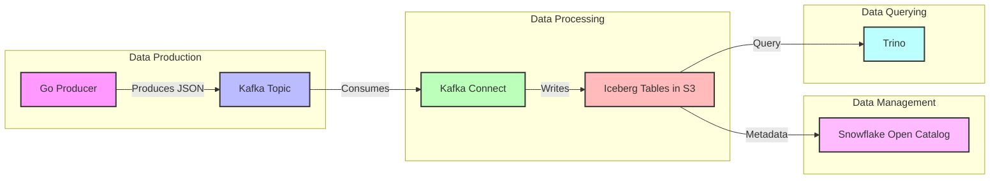
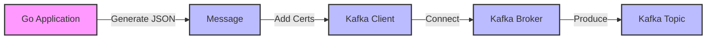
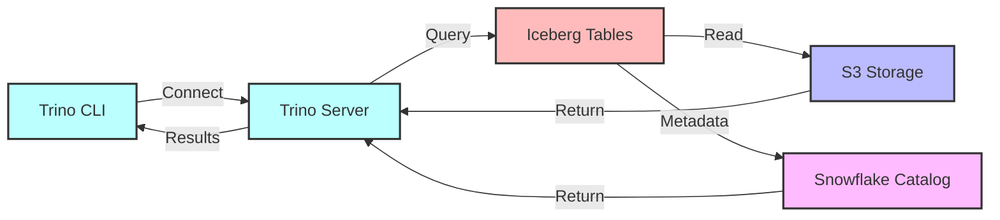

# 🚀 Kafka to Iceberg on S3 with Snowflake Open Catalog & Trino



This guide demonstrates how to build a modern data pipeline that streams data from Kafka to Iceberg tables, with Snowflake Open Catalog managing metadata and Trino for querying.

## 📑 Table of Contents

- [✨ Key Features](#-key-features)
- [🛠️ Prerequisites](#️-prerequisites)
- [🗺️ Detailed Guide](#️-detailed-guide)
  - [1. AWS Setup](#1-aws-setup)
  - [2. Snowflake Open Catalog Setup](#2-snowflake-open-catalog-setup)
  - [3. Aiven Kafka Setup](#3-aiven-kafka-setup)
  - [4. Go Kafka Producer](#4-go-kafka-producer)
  - [5. Data Verification & Querying](#5-data-verification--querying)
- [🧹 Cleanup](#-cleanup)
- [📚 Additional Resources](#-additional-resources)
- [🤝 Contributing](#-contributing)

## ✨ Key Features

- 📊 Real-time data streaming with Apache Kafka
- ❄️ Apache Iceberg tables in AWS S3
- 🔍 Snowflake Open Catalog for metadata management
- 🔎 Trino for efficient querying
- 🛠️ Infrastructure as Code with Terraform
- 🚀 Go-based Kafka producer

## 🛠️ Prerequisites

Before starting, ensure you have:

- **Docker & Docker Compose**
  - For running Trino locally
  - For containerized development environment

- **AWS Account & CLI**
  - AWS CLI installed and configured
  - Appropriate permissions for S3 and IAM
  - AWS credentials configured locally

- **Aiven Account**
  - Access to Aiven Console
  - API token for Terraform
  - Project created in Aiven

- **Snowflake Account**
  - Access to Snowflake Open Catalog
  - ORGADMIN privileges or equivalent

- **Go Development Environment**
  - Go 1.16 or later
  - Basic understanding of Go programming

- **Terraform**
  - Terraform CLI installed
  - Basic understanding of Terraform

## 🗺️ Detailed Guide

### 1. AWS Setup

```mermaid
flowchart LR
    A[Start] --> B[Create IAM User]
    B --> C[Attach IAM Policy]
    C --> D[Configure AWS CLI]
    D --> E[Set Environment Variables]
    E --> F[Run Setup Script]
    F --> G[Create S3 Bucket]
    G --> H[Create IAM Role]
    H --> I[Create IAM Policy]
    I --> J[Attach Policy to Role]
    J --> K[End]

    style A fill:#f9f,stroke:#333,stroke-width:2px
    style K fill:#f9f,stroke:#333,stroke-width:2px
    style B fill:#bbf,stroke:#333,stroke-width:2px
    style C fill:#bbf,stroke:#333,stroke-width:2px
    style D fill:#bbf,stroke:#333,stroke-width:2px
    style E fill:#bbf,stroke:#333,stroke-width:2px
    style F fill:#bbf,stroke:#333,stroke-width:2px
    style G fill:#bbf,stroke:#333,stroke-width:2px
    style H fill:#bbf,stroke:#333,stroke-width:2px
    style I fill:#bbf,stroke:#333,stroke-width:2px
    style J fill:#bbf,stroke:#333,stroke-width:2px
```



#### Step 1: Create or use AWS IAM User
1. Create an AWS User or use an existing one
2. Make sure the following policy is attached to the user (either create or use existing policy):
   ```json
   {
    "Version": "2012-10-17",
    "Statement": [
        {
            "Effect": "Allow",
            "Action": [
                "iam:CreatePolicy",
                "iam:CreateRole",
                "iam:AttachRolePolicy",
                "iam:GetRole",
                "iam:GetPolicy",
                "iam:ListAttachedRolePolicies"
            ],
            "Resource": [
                "arn:aws:iam::<account-id>:role/*",
                "arn:aws:iam::<account-id>:policy/*"
            ]
        },
        {
            "Effect": "Allow",
            "Action": [
                "s3:CreateBucket",
                "s3:HeadBucket",
                "s3:ListBucket",
                "s3:GetBucketLocation",
                "s3:PutBucketPolicy",
                "s3:GetBucketPolicy"
            ],
            "Resource": [
                "arn:aws:s3:::<your-s3-bucket>",
                "arn:aws:s3:::<your-s3-bucket>/*"
            ]
        }
    ]
   }    
   ```

#### Step 2: S3, IAM Role and Policy Setup
To automate the creation of S3, IAM roles and policies required for Snowflake Open Catalog, use the included `setup_snowflake_aws_access.sh` script:
1. Ensure AWS cli is downloaded and run:
   ```bash
   aws configure
   ```
2. You should be prompted to enter your AWS credentials, make sure you use the same aws-region as the S3 bucket you created.

3. Configure Environment Variables (note: for external-id, we can create an id of our choice and use it in the snowflake catalog):
   ```bash
   export AWS_ACCOUNT_ID="your-aws-account-id"
   export EXTERNAL_ID="your-external-id"
   export S3_BUCKET_NAME="your-bucket-name"
   export AWS_REGION="your-aws-region"
   ```
4. Run the Script:
   ```bash
   ./setup_snowflake_aws_access.sh
   ```
   This will create:
   - An S3 bucket in your desired AWS region (e.g., us-west-2)
   - An IAM policy for S3 access
   - An IAM role for Snowflake
   - Attach the policy to the role

### 2. Snowflake Open Catalog Setup

```mermaid
flowchart LR
    A[Start] --> B[Access Snowflake Open Catalog]
    B --> C[Create Catalog Resource]
    C --> D[Configure S3 Connection]
    D --> E[Create Connector]
    E --> F[Create Principal Role]
    F --> G[Create Catalog Role]
    G --> H[Grant Permissions]
    H --> I[End]

    style A fill:#f9f,stroke:#333,stroke-width:2px
    style I fill:#f9f,stroke:#333,stroke-width:2px
    style B fill:#fbf,stroke:#333,stroke-width:2px
    style C fill:#fbf,stroke:#333,stroke-width:2px
    style D fill:#fbf,stroke:#333,stroke-width:2px
    style E fill:#fbf,stroke:#333,stroke-width:2px
    style F fill:#fbf,stroke:#333,stroke-width:2px
    style G fill:#fbf,stroke:#333,stroke-width:2px
    style H fill:#fbf,stroke:#333,stroke-width:2px
```



#### Step 1: Access or Create a Snowflake Open Catalog Account
1. Sign in as an ORGADMIN or create a new account 

#### Step 2: Create a Catalog Resource in Open Catalog
1. Click create a Catalog in Snowflake open catalog
2. In the Snowflake UI, navigate to Catalogs
3. Click "Create Catalog"
4. Fill in the following details:
   - Name: Choose a name for your catalog (e.g., `ICEBERG_CATALOG`)
   - Storage Provider: Select "S3" 
   - Default base location: Enter `s3://<s3-bucket-name>` (e.g., `s3://apache-iceberg-bucket-demo`)
   - S3 Role ARN: Enter the ARN of the role created by setup_snowflake_aws_access.sh
     (Format: `arn:aws:iam::<AWS_ACCOUNT_ID>:role/snowflake_s3_role`)
   - External Id: Enter the external id from the setup_snowflake_aws_access.sh script
5. Click "Create" to finalize the catalog creation
6. Copy the `IAM user arn` in the new catalog details page and edit the `trust relationships` tab for the snowflake_s3_role. For example:
``` JSON
{
   "Version": "2012-10-17",
   "Statement": [
      {
         "Effect": "Allow",
         "Principal": {
            "AWS": "<IAM user arn here>"
         },
         "Action": "sts:AssumeRole",
         "Condition": {
            "StringEquals": {
               "sts:ExternalId": "123"
            }
         }
      }
   ]
}
```

#### Step 3: Create a Connector, Principal, and Principal Roles in snowflake Open Catalog
1. Click under Connections and click `+ Connection`
2. Fill in the following details:
   - Name: Choose a name for your connector
   - Query Engine: Trino
   - Enable Create New Principal Role
   - Name Principal Role
3. Click `Create` and record Client ID and Client Secret (we will use this in the terraform setup)

#### Step 4: Create Namespace in catalog and connect to connector
1. Click under Catalogs, select your Catalog and go to the roles tab. From there press `+ Catalog Role`
2. Create a name and for priviledges select `CATALOG_MANAGE_CONTENT` and any others you need
3. Under the Roles tab you should see your catalog role, click `Grant to Principal Role` and select the catalog role you just created and assign it to the principal role you created in step 3

### 3. Aiven Kafka Setup

```mermaid
flowchart LR
    A[Start] --> B[Configure Terraform Variables]
    B --> C[Initialize Terraform]
    C --> D[Create Kafka Service]
    D --> E[Create Kafka Topics]
    E --> F[Create Kafka Connect]
    F --> G[Configure Iceberg Sink]
    G --> H[End]

    style A fill:#f9f,stroke:#333,stroke-width:2px
    style H fill:#f9f,stroke:#333,stroke-width:2px
    style B fill:#bfb,stroke:#333,stroke-width:2px
    style C fill:#bfb,stroke:#333,stroke-width:2px
    style D fill:#bfb,stroke:#333,stroke-width:2px
    style E fill:#bfb,stroke:#333,stroke-width:2px
    style F fill:#bfb,stroke:#333,stroke-width:2px
    style G fill:#bfb,stroke:#333,stroke-width:2px
```



#### Step 1: Set Up Aiven Services using Terraform
1. **Configure Terraform Variables**
   ```bash
   cd terraform
   cp terraform.tfvars.example terraform.tfvars
   ```
   Edit `terraform.tfvars` and set your values:
   - `aiven_api_token`: Your Aiven API token (Aiven Console https://console.aiven.io/profile/tokens)
   - `aiven_project_name`: Your Aiven project name (Aiven Console https://console.aiven.io/projects)
   - `aws_access_key_id`: Your AWS access key ID
   - `aws_secret_access_key`: Your AWS secret access key
   - `snowflake_uri`: Your Snowflake Open Catalog URI (eg. https://<your-account>.snowflakecomputing.com/polaris/api/catalog)
   - `iceberg_catalog_scope`: Your Principale Role created in Step 3 of Snowflake Open Catalog Setup (format: PRINCIPAL_ROLE:<role>)
   - `snowflake_client_id` `iceberg_s3_access_key`: Your Snowflake Connector client id
   - `snowflake_client_secret`: Your Snowflake Connector secret key

2. **Initialize and Apply Terraform**
   ```bash
   terraform init
   terraform plan
   terraform apply
   ```

   This will create:
   - A Kafka service named `iceberg-kafka`
   - Two Kafka topics: `product` and `iceberg-control`
   - A Kafka Connect service named `iceberg-connect`
   - An Iceberg Sink Connector

### 4. Go Kafka Producer



#### Step 1: Set Up and Run the Go Producer
1. Add your certs from the Aiven for Kafka Service to certs directory (ca.pem, service.cert, service.key)
2. Update `main.go` on line 83 <your-aiven-kafka-broker-address> with the Service URI from Aiven for Kafka Service
3. Build and run the Go application:
   ```bash
   go build
   ./aiven-iceberg-tutorial
   ```

### 5. Data Verification & Querying



#### Step 1: Verify Data in S3
1. Check your S3 bucket to ensure data and metadata are appearing correctly
2. Verify the Iceberg table structure

#### Step 2: Query with Trino
1. Navigate to the `trinocontainer` directory
2. Inside `trinocontainer/trino/etc/catalog/iceberg.properties` and update the values
3. Start the Trino service:
   ```bash
   docker-compose up -d
   ```
4. Connect to Trino CLI:
   ```bash
   docker exec -it trinocontainer-trino-1 trino
   ```
5. Run example queries:
   ```sql
   SHOW SCHEMAS FROM iceberg;
   SELECT * FROM iceberg.spark_demo.product LIMIT 15;
   ```

## 🧹 Cleanup

```bash
# Stop Trino
cd trinocontainer
docker-compose down

# Destroy Terraform resources
cd terraform
terraform destroy

# Clean up AWS resources
# - Remove IAM role and policy
# - Delete S3 bucket
```

## 📚 Additional Resources

- [Apache Iceberg Documentation](https://iceberg.apache.org/docs/latest/)
- [Snowflake Open Catalog Documentation](https://docs.snowflake.com/en/user-guide/catalog-overview)
- [Trino Documentation](https://trino.io/docs/current/)
- [Aiven Documentation](https://docs.aiven.io/)

## 🤝 Contributing

Contributions are welcome! Please feel free to submit a Pull Request.