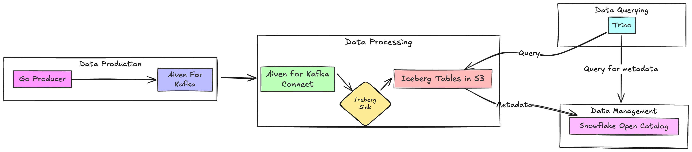

# 🚀 Kafka to Iceberg on S3 with Snowflake Open Catalog & Trino

This tutorial demonstrates how to build a modern data pipeline that streams data from Kafka to Iceberg tables, with Snowflake Open Catalog managing metadata and Trino for querying. The use case streams **ecommerce orders** as master data — each order is captured the moment it is placed and lands in real time in the Iceberg data lake, where analysts can query it through Snowflake or Trino. The system enables real-time data processing and analytics by:

## ✨ Key Features

- 🦀 Real-time data streaming with Aiven for Apache Kafka
- 🗄 Apache Iceberg tables in AWS S3
- ❄️ Snowflake Open Catalog for metadata management
- 🔎 Trino for efficient querying
- 🛠️ Infrastructure as Code with Terraform
- 🚀 Go-based Kafka producer



## 📑 Table of Contents
- [🛠️ Prerequisites](#prerequisites)
- [AWS Setup](#aws-setup)
- [Snowflake Open Catalog Setup](#snowflake-open-catalog-setup)
- [Aiven Kafka Setup](#aiven-kafka-setup)
- [Go Kafka Producer](#go-kafka-producer)
- [Query with Trino](#query-with-trino)
- [🧹 Cleanup](#cleanup)
- [Helpful Resources - 📚](#helpful-resources)

## 🛠️ Prerequisites

<details>
<summary>Click to view prerequisites</summary>

Before starting, ensure you have:

- **Docker & Docker Compose for running Trino locally**

- **AWS Account & AWS CLI installed**

- **Aiven Account, API Token and Project**

- **Snowflake Account with open catalog and ORGADMIN privileges or equivalent**

- **Go Development Environment**

- **Terraform CLI installed**
</details>

## AWS Setup
### Step 1: AWS Checklist
* An AWS S3 Bucket
* An AWS Role snowflake_S3_role with snowflake_S3_access (policy)
   <details>
   <summary>Click to view policy details</summary>

   ```json
   {
       "Statement": [
           {
               "Action": [
                   "s3:PutObject",
                   "s3:GetObject",
                   "s3:GetObjectVersion",
                   "s3:DeleteObject",
                   "s3:DeleteObjectVersion"
               ],
               "Effect": "Allow",
               "Resource": "arn:aws:s3:::<your-iceberg-bucket-name>/*"
           },
           {
               "Action": [
                   "s3:ListBucket",
                   "s3:GetBucketLocation"
               ],
               "Condition": {
                   "StringLike": {
                       "s3:prefix": [
                           "*"
                       ]
                   }
               },
               "Effect": "Allow",
               "Resource": "arn:aws:s3:::<your-iceberg-bucket-name>"
           }
       ],
       "Version": "2012-10-17"
   }
   ```
   </details>
* An AWS Role snowflake_S3_role with trust entity relationship
   <details>
   <summary>Click to view trust relationship details</summary>

   ```json
   {
       "Version": "2012-10-17",
       "Statement": [
           {
               "Effect": "Allow",
               "Principal": {
                   "AWS": "<your_snowflake_catalog_arn>"
               },
               "Action": "sts:AssumeRole",
               "Condition": {
                   "StringEquals": {
                       "sts:ExternalId": "<your-external-id>"
                   }
               }
           }
       ]
   }
   ```
   </details>

> **⚠️ Note:** If you already have these then skip to step Snowflake Open Catalog Setup.


### Step 2: AWS Terraform Setup
<details>
<summary>Click to view AWS terraform setup steps</summary>


#### Step 1: Configure AWS CLI
1. Install the AWS CLI if you haven't already.
2. Run the following command to configure your AWS credentials:
   ```bash
   aws configure
   ```
   You'll be prompted to enter your AWS Access Key ID, Secret Access Key, region, and output format. These credentials will be used by Terraform automatically.

#### Required AWS User Permissions

Your AWS user must have the following permissions to run the Terraform configuration:
```json
{
    "Version": "2012-10-17",
    "Statement": [
        {
            "Effect": "Allow",
            "Action": [
                "iam:CreateRole",
                "iam:CreatePolicy",
                "iam:DeleteRole",
                "iam:GetRole",
                "iam:PutRolePolicy",
                "iam:CreatePolicy",
                "iam:DeleteRolePolicy",
                "iam:PassRole",
                "iam:ListRolePolicies",
                "iam:ListAttachedRolePolicies",
                "iam:TagRole",
                "iam:CreatePolicy",
                "iam:DeletePolicy",
                "iam:GetPolicy",
                "iam:GetPolicyVersion",
                "iam:ListPolicyVersions",
                "iam:AttachRolePolicy",
                "iam:DetachRolePolicy",
                "iam:ListInstanceProfilesForRole",
                "iam:RemoveRoleFromInstanceProfile",
                "iam:UpdateAssumeRolePolicy",
                "iam:DeleteInstanceProfile"
            ],
            "Resource": [
                "arn:aws:iam::<account-id>:role/snowflake_s3_role",
                "arn:aws:iam::<account-id>:policy/snowflake_s3_access"
            ]
        },
        {
            "Effect": "Allow",
            "Action": [
                "s3:CreateBucket",
                "s3:DeleteBucket",
                "s3:GetBucketLocation",
                "s3:ListBucket",
                "s3:PutObject",
                "s3:ListAllMyBuckets",
                "s3:GetBucketAcl",
                "s3:PutBucketAcl",
                "s3:GetBucketPolicy",
                "s3:PutBucketPolicy",
                "s3:DeleteBucketPolicy",
                "s3:GetBucketVersioning",
                "s3:PutBucketVersioning",
                "s3:GetBucketWebsite",
                "s3:PutBucketWebsite",
                "s3:DeleteBucketWebsite",
                "s3:GetBucketCors",
                "s3:PutBucketCors",
                "s3:GetBucketTagging",
                "s3:PutBucketTagging",
                "s3:GetBucketLogging",
                "s3:PutBucketLogging",
                "s3:GetBucketNotification",
                "s3:PutBucketNotification",
                "s3:GetBucketRequestPayment",
                "s3:PutBucketRequestPayment",
                "s3:GetAccelerateConfiguration",
                "s3:GetLifecycleConfiguration",
                "s3:GetReplicationConfiguration",
                "s3:GetEncryptionConfiguration",
                "s3:GetBucketObjectLockConfiguration",
                "s3:PutEncryptionConfiguration"
            ],
            "Resource": [
               "arn:aws:s3:::your-bucket-name",
               "arn:aws:s3:::your-bucket-name/*",
            ]
        }
    ]
}
```

#### Step 2: Configure AWS Terraform
1. Navigate to the AWS Terraform directory:
   ```bash
   cd terraform/aws_setup
   cp terraform.tfvars.example terraform.tfvars
   ```

2. Edit `terraform.tfvars` and set your values:
   - `aws_region`: Your desired AWS region
   - `aws_account_id`: Your AWS account ID
   - `s3_bucket_name`: Your desired S3 bucket name
   - `external_id`: A unique identifier for Snowflake trust relationship (e.g. 123456)

#### Step 3: Initial Terraform plan and configuration
1. Initialize Terraform:
   ```bash
   terraform init
   terraform plan
   terraform apply
   ```

4. Save the outputs, particularly the `iam_role_arn`, as you'll need it for Snowflake setup and **Note:** You'll need to return to this section after creating your Snowflake Open Catalog to update the IAM role's trust policy.

</details>

<br>

## Snowflake Open Catalog Setup

### Step 1: Create a Catalog Resource in Open Catalog
<details>
<summary>Click to view catalog creation steps</summary>

1. In the Snowflake UI, navigate to Catalogs and Click `Create Catalog`
2. Fill in the following details:
   - Name: Choose a name for your catalog (e.g., `ICEBERG_CATALOG`).
   - Storage Provider: Select "S3".
   - Default base location: Enter `s3://<s3-bucket-name>` (e.g., `s3://apache-iceberg-bucket-demo`).
   - S3 Role ARN: Enter the `iam_role_arn` of the role created by Terraform (output from `terraform apply`).
   - External Id: Enter the `external_id` from the `terraform.tfvars`
3. Click `Create` then under catalog details copy the `IAM user arn` and paste it in the `snowflake_iam_user_arn` variable in `terraform/aws_setup/terraform.tfvars`
</details>

### Step 2: Create a Connector, Principal, and Principal Roles in Snowflake Open Catalog
<details>
<summary>Click to view connector creation steps</summary>

1. In Snowflake Open Catalog main page, go to Connections and click `+ Connection`.
2. Fill in the following details:
   - Name: Choose a name for your connector.
   - Query Engine: Trino.
   - Enable Create New Principal Role.
   - Name Principal Role.
3. Click `Create` and record Client ID and Client Secret (we will use this in the terraform setup).
</details>

### Step 3: Attribute roles in your catalog for the connector and Create Namespace
<details>
<summary>Click to view role attribution steps</summary>

1. Go to your Catalog under the roles tab and select `+ Catalog Role`.
2. Create a name and for privileges select `CATALOG_MANAGE_CONTENT` along with any others you need.
3. Under the Roles tab you should see your catalog role, click `Grant to Principal Role` and select the catalog role you just created and assign it to the principal role you created in the previous step.
4. Lastly, create a Namespace in your Catalog
</details>

### Step 4: Update AWS Terraform After Snowflake Catalog Creation
<details>
<summary>Click to view AWS Terraform update steps</summary>

1. After creating your Snowflake Open Catalog, retrieve the `IAM user arn` in the catalog details.
2. Paste the arn in the `snowflake_iam_user_arn` variable in the `terraform.tfvars` file in the AWS Terraform directory:
   ```hcl
   snowflake_iam_user_arn = "arn:aws:iam::123456789012:user/snowflake-user"
   ```

3. Apply the updated configuration:
   ```bash
   terraform apply
   ```

**This will update the IAM role's trust policy to allow Snowflake to assume the role. If you did not use the terraform setup then you will have to do this manually.**
</details>

<br>

## Aiven Kafka Setup
### Step 1: AWS User Permissions needed for Aiven Kafka Setup

> **⚠️ Required (even with the Terraform setup):** The Iceberg Sink Connector writes data files to S3 using the **static AWS keys** you provide in `aws_access_key_id` / `aws_secret_access_key` (`terraform/aiven_setup/terraform.tfvars`). That IAM **user** must be granted the S3 permissions below on your bucket. The AWS Terraform in `terraform/aws_setup` only creates the **Snowflake catalog role** (`snowflake_s3_role`) — it does **not** manage this connector user's policy. If the user lacks `s3:PutObject`, table creation appears to succeed (the catalog writes the empty table metadata via its own role) but data commits fail with `403 ... not authorized to perform: s3:PutObject`, and the connector task dies. See Aiven Docs [here](https://aiven.io/docs/products/kafka/kafka-connect/howto/iceberg-sink-connector).

<details>
<summary>Click to view permissions details</summary>

```json
{
    "Version": "2012-10-17",
    "Statement": [
        {
            "Sid": "S3Access",
            "Effect": "Allow",
            "Action": [
                "s3:GetObject",
                "s3:PutObject",
                "s3:DeleteObject",
                "s3:ListBucket",
                "s3:GetBucketLocation",
                "s3:AbortMultipartUpload",
                "s3:ListMultipartUploadParts"
            ],
            "Resource": [
                "arn:aws:s3:::<your-s3-bucket>/*"
            ]
        },
        {
            "Sid": "S3ListBucket",
            "Effect": "Allow",
            "Action": "s3:ListBucket",
            "Resource": [
                "arn:aws:s3:::<your-s3-bucket>"
            ]
        }
    ]
}
```
</details>

### Step 2: Set Up Aiven Services using Terraform
<details>
<summary>Click to view Aiven service setup steps</summary>

1. **Configure Terraform Variables**
   ```bash
   cd terraform/aiven_setup
   cp terraform.tfvars.example terraform.tfvars
   ```
   Edit `terraform.tfvars` and set your values:
   - `aiven_api_token`: Your Aiven API token in [Aiven Console](https://console.aiven.io/profile/tokens)
   - `aiven_project_name`: Your Aiven project name in [Aiven Console](https://console.aiven.io/projects)
   - `aws_access_key_id`: Your AWS access key ID with the necesarry permissions (see step 1 above).
   - `aws_secret_access_key`: Your AWS secret access key with the necesarry permissions (see step 1 above).
   - `snowflake_uri`: Your Snowflake Open Catalog URI. The format may vary depending on your Snowflake account type and region.
     Common format: https://{account-id}.{region}.snowflakecomputing.com/polaris/api/catalog
     For more details and alternative formats, refer to [Snowflake's Open Catalog documentation](https://docs.snowflake.com/en/sql-reference/sql/create-catalog-integration-open-catalog).
   - `iceberg_catalog_scope`: Your Principal Role created in Step 3 of Snowflake Open Catalog Setup (format: PRINCIPAL_ROLE:{your-principal-role-name}).
   - `snowflake_client_id`: Your Snowflake Connector client id.
   - `snowflake_client_secret`: Your Snowflake Connector secret key.

   **Note:** Make sure whatever table you are using in Snowflake Open Catalog exists before running terraform, this avoids possible race conditions.

2. **Initialize and Apply Terraform**
   ```bash
   terraform init
   terraform plan
   terraform apply
   ```

   This will create:
   - A Kafka service named `iceberg-kafka`.
   - Two Kafka topics: `order` and `iceberg-control`.
   - A Kafka Connect service named `iceberg-connect`.
   - An Iceberg Sink Connector.
</details>

<br>

## Go Kafka Producer
### Step 1: Set Up and Run the Go Producer
<details>
<summary>Click to view Go producer setup steps</summary>

1. **Configure connection via environment variables**
   - The producer connects over **SASL_SSL** using the broker's **Let's Encrypt** public certificate, so no `ca.pem` / client certificate download is required — Go trusts the public CA via the system trust store.
   - Copy the example env file and fill in your values:
     ```bash
     cp .env.example .env
     # edit .env, then:
     source .env
     ```
   - Set the following (from the Aiven Console: **Service > Connection information**, with authentication set to **SASL**):
     - `KAFKA_SERVICE_URI`: the **SASL_SSL** broker address (a different port than the certificate/mTLS endpoint), e.g. `kafka-iceberg-demo.a.aivencloud.com:12345`.
     - `KAFKA_USERNAME`: Kafka SASL username (e.g. `avnadmin`).
     - `KAFKA_PASSWORD`: Kafka SASL password.
   - The `.env` file is git-ignored so your credentials are not committed.

   > **Note:** This requires SASL authentication and the Let's Encrypt SASL certificate to be enabled on the Kafka service (set in `terraform/aiven_setup/main.tf` via `kafka_authentication_methods.sasl = true` and `letsencrypt_sasl = true`).

2. **Build and Run**
   ```bash
   go build
   source .env   # if not already sourced
   ./aiven-iceberg-tutorial
   ```

   > **⚠️ Produce *while* the connector is running.** The Iceberg sink's consumer effectively starts at **latest** (the managed Kafka Connect override policy may ignore `consumer.override.auto.offset.reset=earliest`). Records that are already in the topic *before* the connector/tasks start are skipped — so make sure the connector is in `RUNNING` state first, then run the producer. If you produced earlier and see no data landing, simply re-run the producer.

The application will:
- Generate 15 mock order records.
- Send each order to the Kafka topic with a unique key.
- Log the partition and offset for each message sent.

You should see output similar to:
```
Starting Kafka producer...
Sent order 1 to partition 0 at offset 0
Sent order 2 to partition 0 at offset 1
...
All orders sent successfully.
```
</details>

### Step 2: Understanding the Data Flow and Transformations
<details>
<summary>Click to view data flow details</summary>

The data pipeline includes a transformation step in Kafka Connect that's crucial for proper Iceberg table structure:

1. **Message Structure**
   - The Go producer sends messages with both a key and value:
     ```json
     // Key
     {
       "keyId": 10,
       "keyCode": "O1"
     }
     // Value
     {
       "orderId": 1,
       "customerId": 42,
       "product": "Headphones",
       "quantity": 2,
       "amount": 59.98,
       "status": "PAID",
       "orderDate": "2026-06-28T10:15:30Z"
     }
     ```

2. **Kafka Connect Transformation**
   - The `KeyToValue` transformation (`k2v`) is used to:
     - Move the `keyId` from the message key to the value.
     - Rename it to `kId` in the value.
   - This ensures all relevant data is stored in the Iceberg table.
   - Without this transformation, the key information would be lost in the Iceberg table.

3. **Resulting Iceberg Table Structure**
   ```sql
   CREATE TABLE orders (
      orderId BIGINT,
      customerId BIGINT,
      product VARCHAR,
      quantity BIGINT,
      amount DOUBLE,
      status VARCHAR,
      orderDate VARCHAR,
      kId BIGINT
   );
   ```

This transformation is essential because:
- Iceberg tables need all data in the value portion.
- Message keys are typically used for partitioning in Kafka but aren't automatically included in the table.
- The transformation preserves the key information while maintaining a clean table structure.
</details>

<br>

## Query with Trino
### Step 1: Run Trino Container and Execute Query
<details>
<summary>Click to view Trino setup and query steps</summary>

1. Navigate to the `trinocontainer` directory.
2. Inside `trinocontainer/trino/etc/catalog/iceberg.properties` and update the values.
3. Start the Trino service:
   ```bash
   docker-compose up -d
   ```
4. Connect to Trino CLI:
   ```bash
   docker exec -it trinocontainer-trino-1 trino
   ```
5. Run example queries:
   ```sql
   SHOW SCHEMAS FROM iceberg;
   SELECT * FROM iceberg.`namespace`.`tablename` LIMIT 15;
   ```
   > **💡 Tip:** We recommend using the plural form for the table name, for example `order` → `orders`. And if the table name happens to be a reserved SQL keyword (like `order`), wrap it in quotes when querying, e.g. `SELECT * FROM iceberg.`namespace`.`order` LIMIT 15;`
</details>

<br>

## 🧹 Cleanup

```bash
# Stop Trino
cd trinocontainer
docker-compose down

# Destroy Terraform resources
cd terraform/aws_setup
terraform destroy

cd ../aiven_setup
terraform destroy

# Clean up Snowflake resources
# - Remove table, namespace and catalog
# - Remove connection and principal role
```

## Helpful Resources - 📚
- [Aiven Iceberg Sink Connector Documentation](https://aiven.io/docs/products/kafka/kafka-connect/howto/iceberg-sink-connector)
- [Apache Iceberg Documentation](https://iceberg.apache.org/docs/latest/)
- [Snowflake Open Catalog Documentation](https://docs.snowflake.com/en/user-guide/catalog-overview)
- [Trino Documentation](https://trino.io/docs/current/)
- [Aiven Documentation](https://docs.aiven.io/)