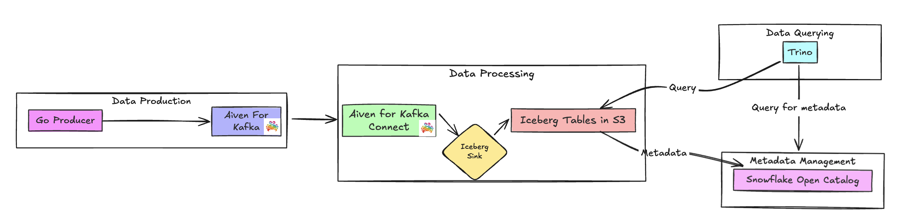

# 🚀 Kafka to Iceberg on S3 with Snowflake Open Catalog & Trino

This tutorial demonstrates how to build a modern data pipeline that streams data from Kafka to Iceberg tables, with Snowflake Open Catalog managing metadata and Trino for querying. The system enables real-time data processing and analytics by:

## ✨ Key Features

- 🦀 Real-time data streaming with Aiven for Apache Kafka
- 🗄 Apache Iceberg tables in AWS S3
- ❄️ Snowflake Open Catalog for metadata management
- 🔎 Trino for efficient querying
- 🛠️ Infrastructure as Code with Terraform
- 🚀 Go-based Kafka producer



## 📑 Table of Contents
- [🛠️ Prerequisites](#️-prerequisites)
- [🗺️ Detailed Guide](#️-detailed-guide)
  - [1. AWS Setup](#1-aws-setup)
  - [2. Snowflake Open Catalog Setup](#2-snowflake-open-catalog-setup)
  - [3. Aiven Kafka Setup](#3-aiven-kafka-setup)
  - [4. Go Kafka Producer](#4-go-kafka-producer)
  - [5. Query with Trino](#5-query-with-trino)
- [🧹 Cleanup](#-cleanup)
- [📚 Additional Resources](#-additional-resources)
- [🤝 Contributing](#-contributing)

## 🛠️ Prerequisites

Before starting, ensure you have:

- **Docker & Docker Compose for running Trino locally**

- **AWS Account & AWS CLI installed**

- **Aiven Account, API Token and Project**

- **Snowflake Account with open catalog and ORGADMIN privileges or equivalent**

- **Go Development Environment**

- **Terraform CLI installed**

## 🗺️ Detailed Guide

### 1. AWS Setup

#### Step 1: Configure AWS CLI
1. Install the AWS CLI if you haven't already.
2. Run the following command to configure your AWS credentials:
   ```bash
   aws configure
   ```
   You'll be prompted to enter your AWS Access Key ID, Secret Access Key, region, and output format. These credentials will be used by Terraform automatically.

#### Required AWS User Permissions

Your AWS user must have the following permissions to run the Terraform configuration:
```json
{
    "Version": "2012-10-17",
    "Statement": [
        {
            "Effect": "Allow",
            "Action": [
                "iam:CreateRole",
                "iam:DeleteRole",
                "iam:GetRole",
                "iam:PutRolePolicy",
                "iam:CreatePolicy",
                "iam:DeleteRolePolicy",
                "iam:PassRole",
                "iam:ListRolePolicies",
                "iam:ListAttachedRolePolicies",
                "iam:TagRole",
                "iam:CreatePolicy",
                "iam:DeletePolicy",
                "iam:GetPolicy",
                "iam:GetPolicyVersion",
                "iam:ListPolicyVersions",
                "iam:AttachRolePolicy",
                "iam:DetachRolePolicy",
                "iam:ListInstanceProfilesForRole",
                "iam:RemoveRoleFromInstanceProfile",
                "iam:DeleteInstanceProfile"
            ],
            "Resource": [
                "arn:aws:iam::<account-id>:role/snowflake_s3_role",
                "arn:aws:iam::<account-id>:policy/snowflake_s3_policy"
            ]
        },
        {
            "Effect": "Allow",
            "Action": [
                "s3:CreateBucket",
                "s3:DeleteBucket",
                "s3:GetBucketLocation",
                "s3:ListBucket",
                "s3:PutObject",
                "s3:ListAllMyBuckets",
                "s3:GetBucketAcl",
                "s3:PutBucketAcl",
                "s3:GetBucketPolicy",
                "s3:PutBucketPolicy",
                "s3:DeleteBucketPolicy",
                "s3:GetBucketVersioning",
                "s3:PutBucketVersioning",
                "s3:GetBucketWebsite",
                "s3:PutBucketWebsite",
                "s3:DeleteBucketWebsite",
                "s3:GetBucketCors",
                "s3:PutBucketCors",
                "s3:GetBucketTagging",
                "s3:PutBucketTagging",
                "s3:GetBucketLogging",
                "s3:PutBucketLogging",
                "s3:GetBucketNotification",
                "s3:PutBucketNotification",
                "s3:GetBucketRequestPayment",
                "s3:PutBucketRequestPayment",
                "s3:GetAccelerateConfiguration",
                "s3:GetLifecycleConfiguration",
                "s3:GetReplicationConfiguration",
                "s3:GetEncryptionConfiguration",
                "s3:GetBucketObjectLockConfiguration",
                "s3:PutEncryptionConfiguration"
            ],
            "Resource": [
               "arn:aws:s3:::your-bucket-name",
               "arn:aws:s3:::your-bucket-name/*",
            ]
        }
    ]
}
```

#### Step 2: Configure AWS Terraform
1. Navigate to the AWS Terraform directory:
   ```bash
   cd terraform/aws_setup
   cp terraform.tfvars.example terraform.tfvars
   ```

2. Edit `terraform.tfvars` and set your values:
   - `aws_region`: Your desired AWS region
   - `aws_account_id`: Your AWS account ID
   - `s3_bucket_name`: Your desired S3 bucket name
   - `external_id`: A unique identifier for Snowflake trust relationship (e.g. 123456)

#### Step 3: Initial Terraform plan and configuration
1. Initialize Terraform:
   ```bash
   terraform init
   terraform plan
   terraform apply
   ```

4. Save the outputs, particularly the `iam_role_arn`, as you'll need it for Snowflake setup and **Note:** You'll need to return to this section after creating your Snowflake Open Catalog to update the IAM role's trust policy.

### 2. Snowflake Open Catalog Setup

#### Step 1: Create a Catalog Resource in Open Catalog
1. In the Snowflake UI, navigate to Catalogs and Click `Create Catalog`
2. Fill in the following details:
   - Name: Choose a name for your catalog (e.g., `ICEBERG_CATALOG`).
   - Storage Provider: Select "S3".
   - Default base location: Enter `s3://<s3-bucket-name>` (e.g., `s3://apache-iceberg-bucket-demo`).
   - S3 Role ARN: Enter the `iam_role_arn` of the role created by Terraform (output from `terraform apply`).
   - External Id: Enter the `external_id` from the `terraform.tfvars`
3. Click `Create` then under catalog details copy the `IAM user arn` and paste it in the `snowflake_iam_user_arn` variable in `terraform/aws_setup/terraform.tfvars`

#### Step 2: Create a Connector, Principal, and Principal Roles in Snowflake Open Catalog
1. In Snowflake Open Catalog main page, go to Connections and click `+ Connection`.
2. Fill in the following details:
   - Name: Choose a name for your connector.
   - Query Engine: Trino.
   - Enable Create New Principal Role.
   - Name Principal Role.
3. Click `Create` and record Client ID and Client Secret (we will use this in the terraform setup).

#### Step 3: Attribute roles in your catalog for the connector and Create Namespace
1. Go to your Catalog under the roles tab and select `+ Catalog Role`.
2. Create a name and for privileges select `CATALOG_MANAGE_CONTENT` along with any others you need.
3. Under the Roles tab you should see your catalog role, click `Grant to Principal Role` and select the catalog role you just created and assign it to the principal role you created in the previous step.
4. Lastly, create a Namespace in your Catalog

#### Step 4: Update AWS Terraform After Snowflake Catalog Creation
1. After creating your Snowflake Open Catalog, retrieve the `IAM user arn` in the catalog details.
2. Paste the arn in the `snowflake_iam_user_arn` variable in the `terraform.tfvars` file in the AWS Terraform directory:
   ```hcl
   snowflake_iam_user_arn = "arn:aws:iam::123456789012:user/snowflake-user"
   ```

4. Apply the updated configuration:
   ```bash
   terraform apply
   ```

This will update the IAM role's trust policy to allow Snowflake to assume the role.

### 3. Aiven Kafka Setup

#### Step 1: Set Up Aiven Services using Terraform
1. **Configure Terraform Variables**
   ```bash
   cd terraform/aiven_setup
   cp terraform.tfvars.example terraform.tfvars
   ```
   Edit `terraform.tfvars` and set your values:
   - `aiven_api_token`: Your Aiven API token in [Aiven Console](https://console.aiven.io/profile/tokens)
   - `aiven_project_name`: Your Aiven project name in [Aiven Console](https://console.aiven.io/projects)
   - `aws_access_key_id`: Your AWS access key ID.
   - `aws_secret_access_key`: Your AWS secret access key.
   - `snowflake_uri`: Your Snowflake Open Catalog URI. The format may vary depending on your Snowflake account type and region.
     Common format: https://{account-id}.{region}.snowflakecomputing.com/polaris/api/catalog
     For more details and alternative formats, refer to [Snowflake's Open Catalog documentation](https://docs.snowflake.com/en/sql-reference/sql/create-catalog-integration-open-catalog).
   - `iceberg_catalog_scope`: Your Principal Role created in Step 3 of Snowflake Open Catalog Setup (format: PRINCIPAL_ROLE:{your-principal-role-name}).
   - `snowflake_client_id`: Your Snowflake Connector client id.
   - `snowflake_client_secret`: Your Snowflake Connector secret key.

   **Note:** Make sure whatever table you are using in Snowflake Open Catalog exists before running terraform, this avoids possible race conditions.


2. **Initialize and Apply Terraform**
   ```bash
   terraform init
   terraform plan
   terraform apply
   ```

   This will create:
   - A Kafka service named `iceberg-kafka`.
   - Two Kafka topics: `product` and `iceberg-control`.
   - A Kafka Connect service named `iceberg-connect`.
   - An Iceberg Sink Connector.

### 4. Go Kafka Producer

#### Step 1: Set Up and Run the Go Producer
1. **Certificate Setup**
   - Create a `certs` directory in your project root and download the following certificate files from your Aiven for Kafka Service dashboard:
     - Navigate to your Kafka service in Aiven Console.
     - Go to the "Connection Information" tab.
     - Download:
       - `ca.pem`: The CA certificate.
       - `service.cert`: The service certificate.
       - `service.key`: The service private key.
   - Place these files in the `certs` directory.

2. **Configure Kafka Broker Address**
   - Open `main.go` in your editor.
   - Locate the `KafkaBrokerAddress` constant (around line 16).
   - Replace `<your-kafka-broker-address>` with your Aiven Kafka Service URI.
     - You can find this in your Aiven Console under the Kafka service's "Connection Information" tab.
     - It will look something like: `kafka-iceberg-demo.a.aivencloud.com:12345`.

3. **Build and Run**
   ```bash
   go build
   ./aiven-iceberg-tutorial
   ```

The application will:
- Generate 15 mock product records.
- Send each product to the Kafka topic with a unique key.
- Log the partition and offset for each message sent.

You should see output similar to:
```
Starting Kafka producer...
Sent product 1 to partition 0 at offset 0
Sent product 2 to partition 0 at offset 1
...
All products sent successfully.
```

#### Step 2: Understanding the Data Flow and Transformations

The data pipeline includes a transformation step in Kafka Connect that's crucial for proper Iceberg table structure:

1. **Message Structure**
   - The Go producer sends messages with both a key and value:
     ```json
     // Key
     {
       "keyId": 10,
       "keyCode": "P1"
     }
     // Value
     {
       "id": 1,
       "name": "Product 1",
       "quantity": 50,
       "price": 29.99
     }
     ```

2. **Kafka Connect Transformation**
   - The `KeyToValue` transformation (`k2v`) is used to:
     - Move the `keyId` from the message key to the value.
     - Rename it to `kId` in the value.
   - This ensures all relevant data is stored in the Iceberg table.
   - Without this transformation, the key information would be lost in the Iceberg table.

3. **Resulting Iceberg Table Structure**
   ```sql
   CREATE TABLE product (
      name VARCHAR,
      quantity BIGINT,
      id BIGINT,
      price DOUBLE,
      kId BIGINT
   );
   ```

This transformation is essential because:
- Iceberg tables need all data in the value portion.
- Message keys are typically used for partitioning in Kafka but aren't automatically included in the table.
- The transformation preserves the key information while maintaining a clean table structure.

### 5. Query with Trino

#### Step 1: Run Trino Container and Execute Query
1. Navigate to the `trinocontainer` directory.
2. Inside `trinocontainer/trino/etc/catalog/iceberg.properties` and update the values.
3. Start the Trino service:
   ```bash
   docker-compose up -d
   ```
4. Connect to Trino CLI:
   ```bash
   docker exec -it trinocontainer-trino-1 trino
   ```
5. Run example queries:
   ```sql
   SHOW SCHEMAS FROM iceberg;
   SELECT * FROM iceberg.`namespace`.`tablename` LIMIT 15;
   ```

## 🧹 Cleanup

```bash
# Stop Trino
cd trinocontainer
docker-compose down

# Destroy Terraform resources
cd terraform/aws_setup
terraform destroy

cd ../aiven_setup
terraform destroy

# Clean up Snowflake resources
# - Remove table, namespace and catalog
# - Remove connection and principal role
```

## 📚 Additional Resources

- [Apache Iceberg Documentation](https://iceberg.apache.org/docs/latest/)
- [Snowflake Open Catalog Documentation](https://docs.snowflake.com/en/user-guide/catalog-overview)
- [Trino Documentation](https://trino.io/docs/current/)
- [Aiven Documentation](https://docs.aiven.io/)

## 🤝 Contributing

Contributions are welcome! Please feel free to submit a Pull Request.