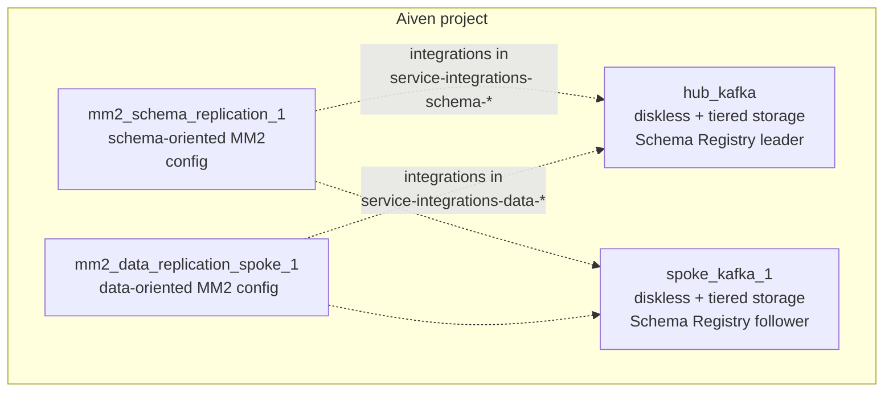

# Diskless spokes–hub — infrastructure setup

Terraform root that provisions **core Aiven services** for a **diskless Kafka hub–spoke** example: two Kafka clusters (hub and spoke) and **two** dedicated **Kafka MirrorMaker 2 (MM2)** services—one tuned for **schema-oriented** mirroring and one for **general data** mirroring.

This folder intentionally creates **Kafka + MM2 services only**. **`aiven_service_integration`** resources that wire MM2 to hub/spoke (including paths that use **`external_kafka`** endpoints) live in sibling modules so you can iterate connectivity without re-applying cluster plans.

## Relationship to other folders

| Piece | Role |
|-------|------|
| [`../project-integrations`](../project-integrations) | Registers **`external_kafka`** integration endpoints (bootstrap, SASL, CA) so MM2 or other services can reach Kafka across network boundaries. |
| [`../service-integrations-schema-replication`](../service-integrations-schema-replication) | Attaches **schema** MM2 (`mm2_schema_replication_1`) to hub/spoke (hub in-project, spoke via endpoint in the shipped example). |
| [`../service-integrations-data-replication`](../service-integrations-data-replication) | Attaches **data** MM2 (`mm2_data_replication_spoke_1`) to hub/spoke (spoke in-project, hub via endpoint in the shipped example). |
| [`../replication-setup`](../replication-setup) | Additional replication-related Terraform (topics, connectors, etc.—see that folder’s readme if present). |

## Design: what this root is doing

### Topology (services only)



- **Hub and spoke** are normal **`aiven_kafka`** services with **diskless** storage, **tiered storage**, **follower fetching**, **Kafka 4.0**, **Schema Registry**, and **SASL + certificate** auth. Public access to Kafka, REST, Connect, and Schema Registry is disabled in the example `kafka_user_config`.
- **Schema Registry leadership**: hub has `leader_eligibility = true`; spoke has `leader_eligibility = false`, matching a common pattern where the hub is the primary registry for the mesh.
- **Both MM2 services** are deployed on **`cloud_name_hub`** in this example (MM2 colocated with the hub cloud), each with its own plan variable. They do not replicate anything until **`aiven_service_integration`** resources are applied from the **`service-integrations-*`** folders.

### Why two MM2 services?

MM2’s **`kafka_mirrormaker_user_config`** controls how aggressively it discovers topics, syncs topic configs, refreshes consumer groups, and emits checkpoints. **Schema** and **data** replication have different operational needs, so this solution uses **two MM2 services** with different flags instead of overloading one MM2 with conflicting goals.

| MM2 resource | Service name suffix (from `service_prefix`) | Topic / config refresh | Typical use in this solution |
|--------------|---------------------------------------------|-------------------------|------------------------------|
| `mm2_schema_replication_1` | `-mm2-spoke-1-schema-replication` | `refresh_topics_enabled` / `sync_topic_configs_enabled` **on** | Schema subjects / config-style mirroring |
| `mm2_data_replication_spoke_1` | `-mm2-data-replication-spoke-1` | Same toggles **off** | Broader data-topic mirroring without schema-only narrowing |

Both still enable group refresh, offset sync, checkpoints, and similar baseline MM2 behavior (see `main.tf` for exact numbers).

### Readiness wait

**`time_sleep.wait_mm2_readiness`** waits **600 seconds** after the two Kafka clusters and both MM2 services exist. Use it to reduce races where downstream steps (manual or other Terraform roots) assume brokers and MM2 are fully live. It does not replace health checks for production automation.

## What `main.tf` defines

1. **`aiven_kafka.hub_kafka`** — Hub cluster, `${var.service_prefix}-hub-kafka-1`.
2. **`aiven_kafka.spoke_kafka_1`** — Spoke cluster, `${var.service_prefix}-spoke-kafka-1`.
3. **`aiven_kafka_mirrormaker.mm2_schema_replication_1`** — Schema-oriented MM2.
4. **`aiven_kafka_mirrormaker.mm2_data_replication_spoke_1`** — Data-oriented MM2.
5. **`time_sleep.wait_mm2_readiness`** — Post-create delay depending on the four resources above.

Optional reference: [`diskless_topics_names.txt`](diskless_topics_names.txt) lists example topic names you might create for demos.

## Prerequisites

- [Terraform](https://www.terraform.io/downloads) compatible with the provider constraints in `provider.tf`
- An [Aiven](https://aiven.io/) account and project
- An Aiven [API token](https://docs.aiven.io/docs/platform/howto/create-api-token)
- Valid **`cloud_name_*`** values and **plans** for your account (defaults in `variables.tf` are examples and may not apply to your tenant)

## Provider requirements

| Provider | Version (constraint) | Used in this `main.tf` |
|----------|----------------------|-------------------------|
| **aiven** | ~> 4.0 | yes |
| **time** | 0.7.2 | yes (`time_sleep`) |
| **env** | 0.0.2 | declared; not used in current `main.tf` |
| **null** | ~> 3.0 | declared; not used in current `main.tf` |

`env` and `null` stay declared so this root stays aligned with other roots in the solution when you merge or copy snippets.

## Variables

| Variable | Description | Default |
|----------|-------------|---------|
| `aiven_api_token` | Aiven API token | *(required)* |
| `aiven_project_name` | Aiven project name | `sa-inkless-gcp` |
| `service_prefix` | Prefix for created service names | `mp-demo` |
| `cloud_name_hub` | Aiven cloud / region for hub Kafka and **both** MM2 services | see `variables.tf` |
| `cloud_name_spoke_1` | Aiven cloud / region for spoke Kafka | see `variables.tf` |
| `hub_kafka_plan` | Plan for hub Kafka | `business-8-inkless` |
| `spoke_kafka_plan` | Plan for spoke Kafka | `business-8-inkless` |
| `mm2_plan_hub_cluster` | Plan for **schema** MM2 (`mm2_schema_replication_1`) | `business-4` |
| `mm2_plan_spoke_cluster` | Plan for **data** MM2 (`mm2_data_replication_spoke_1`) | `business-4` |

Copy [`variables-example.tfvars.examples`](variables-example.tfvars.examples) to a local `*.tfvars` file and adjust values. **Do not commit** secrets (API token) or environment-specific `*.tfvars`.

## Usage

```bash
cd infra-setup
terraform init
terraform plan -var-file=your.tfvars
terraform apply -var-file=your.tfvars
```

Apply [`../project-integrations`](../project-integrations) and the **`service-integrations-*`** roots as needed so MM2 is actually connected to Kafka (this root alone does not create those integrations).

## Outputs and next steps

- Wire MM2 with **`aiven_service_integration`** using [`../service-integrations-schema-replication`](../service-integrations-schema-replication) and [`../service-integrations-data-replication`](../service-integrations-data-replication).
- Register **`external_kafka`** endpoints in [`../project-integrations`](../project-integrations) when a cluster must be reached outside plain in-project service DNS.
- Continue with [`../replication-setup`](../replication-setup) for additional replication-related resources, if you use that module in your workflow.
