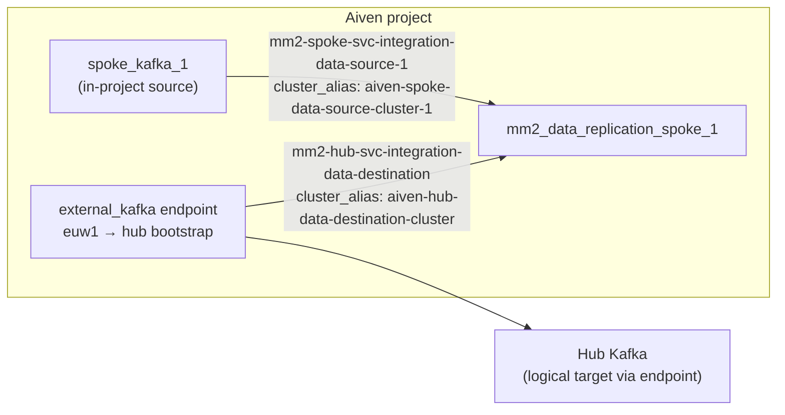

# Service integrations — data replication (MM2)

Terraform configuration for **Kafka MirrorMaker 2** service integrations used for **topic and data replication** (not schema-only mirroring) between the **spoke** Aiven Kafka service and the **hub** Kafka cluster, via the dedicated **`mm2_data_replication_spoke_1`** MM2 service.

This root module is the **split-out** counterpart to the data-replication integration blocks that may still exist under [`../infra-setup`](../infra-setup): you typically remove duplicate `aiven_service_integration` resources from `infra-setup` and manage them only here, so connectivity can evolve independently of base cluster provisioning.

## Relationship to other folders

| Piece | Role |
|-------|------|
| [`../infra-setup`](../infra-setup) | Provisions **spoke Kafka**, the **hub** Kafka (elsewhere in the topology), and the **`aiven_kafka_mirrormaker.mm2_data_replication_spoke_1`** service with MM2 user settings tuned for **data** paths (`refresh_topics_enabled` / `sync_topic_configs_enabled` off for schema-style behavior; group offset sync on, and so on—see infra for exact flags). |
| [`../project-integrations`](../project-integrations) | Registers the **`aiven_service_integration_endpoint`** of type `external_kafka` (bootstrap, SASL, CA) for clusters MM2 must reach **without** relying on in-project service DNS. You pass the resulting endpoint ID into this module where `source_endpoint_id` is used. |
| [`../service-integrations-schema-replication`](../service-integrations-schema-replication) | Same **two-integration / one-MM2** pattern for **schema** replication; which leg uses `source_service_name` vs `source_endpoint_id` is **inverted** relative to this folder (see design below). |

This directory’s **`provider.tf`** matches **[`../infra-setup/provider.tf`](../infra-setup/provider.tf)** (required providers + `provider "aiven"`). **`variables.tf`** adds **`aiven_api_token`** and **`aiven_project_name`** so this folder can run as its own Terraform root, plus **`external_source_aiven_kafka_endpoint_id_euw1`**, which is the endpoint ID the hub leg consumes.

## Design: what this module is really doing

MirrorMaker 2 needs **two cluster definitions** wired into **one** MM2 service: each definition is an `aiven_service_integration` with `integration_type = "kafka_mirrormaker"`, the **same** `destination_service_name` (the MM2 service), and a **distinct** `cluster_alias` so MM2 can route replication between logical sources/sinks.

### How this differs from schema replication in this repo

| Leg | Schema replication ([`service-integrations-schema-replication`](../service-integrations-schema-replication)) | Data replication (this folder) |
|-----|---------------------------------------------------------------------------------------------------------------|--------------------------------|
| First integration | **Hub** attached by **`source_service_name`** (in-project Kafka service; same VPC / DNS as MM2) | **Spoke** attached by **`source_service_name`** (spoke is in the same project as MM2) |
| Second integration | **Spoke** attached by **`source_endpoint_id`** → `external_source_aiven_kafka_endpoint_id_use1` | **Hub** attached by **`source_endpoint_id`** → `external_source_aiven_kafka_endpoint_id_euw1` |

So both solutions solve **“MM2 cannot treat both clusters as plain `source_service_name`”** for at least one hop: one leg always uses a **project-level `external_kafka` endpoint** so MM2 can authenticate and bootstrap to Kafka over the path you registered (e.g. another region, private network, or non-default resolution). **Schema** keeps the hub on the “easy” in-project leg and the spoke on the endpoint; **data** keeps the spoke on the in-project leg and the hub on the endpoint (`euw1` in variable naming reflects which regional endpoint this example wires in—adjust names to match your real endpoints).

### Data flow (conceptual)



After both integrations exist, `aiven_mirrormaker_replication_flow.spoke_to_hub_data` mirrors **spoke → hub** telemetry/business topics between the aliased clusters. The flow uses `IdentityReplicationPolicy` to preserve topic names, enables exactly-once delivery by default, and keeps internal / replica / Connect topics out through `replication_topics_blacklist`.

### What `main.tf` defines

1. **`mm2-spoke-svc-integration-data-source-1`** — MM2 **source** is the **spoke** Aiven Kafka service (`source_service_name = aiven_kafka.spoke_kafka_1.service_name`). Producer-oriented `kafka_mirrormaker_user_config` (batch size, linger, buffer memory, max request size) matches the pattern used elsewhere in this solution for MM2 throughput tuning.

2. **`mm2-hub-svc-integration-data-destination`** — MM2 **source** is the **hub** cluster reached through the **`external_kafka`** integration endpoint (`source_endpoint_id = var.external_source_aiven_kafka_endpoint_id_euw1`). The resource name says “destination” in the sense of **hub-as-destination in the overall hub/spoke story**; in MM2 terms it is still a **source cluster attachment** to the MM2 service (another `cluster_alias`).

3. **`spoke_to_hub_data`** — MM2 replication flow from `aiven-spoke-data-source-cluster-1` to `aiven-hub-data-destination-cluster`. Configure `data_replication_topics` with the telemetry/CDIP business topic regexes you want to land in the hub.

Official reference: [aiven_service_integration](https://registry.terraform.io/providers/aiven/aiven/latest/docs/resources/service_integration).

## Prerequisites

- Terraform compatible with the provider constraints in `provider.tf`
- An Aiven API token and project
- **`aiven_kafka.spoke_kafka_1`** and **`aiven_kafka_mirrormaker.mm2_data_replication_spoke_1`** must exist in the same Terraform state as this module (e.g. apply [`../infra-setup`](../infra-setup) first, or merge `.tf` files, or replace references with `data` / `terraform_remote_state`—this repo’s `main.tf` assumes those resources are in scope)
- **`external_kafka` endpoint** for the hub path (from [`../project-integrations`](../project-integrations) or equivalent) for `external_source_aiven_kafka_endpoint_id_euw1`

## Provider requirements

Same as [`../infra-setup/readme.md`](../infra-setup/readme.md#provider-requirements) if documented there: **aiven** (~> 4.0), **time** (0.7.2), **env** (0.0.2), **null** (~> 3.0). Only **aiven** is required for the resources in `main.tf`; the other providers are declared to stay aligned with `infra-setup`.

## Variables

| Variable | Required | Description |
|----------|----------|-------------|
| `aiven_api_token` | yes | Aiven API token for the provider |
| `aiven_project_name` | yes | Aiven project for all integrations |
| `external_source_aiven_kafka_endpoint_id_euw1` | yes | Endpoint ID for the **hub**-side MM2 source on `mm2-hub-svc-integration-data-destination` |
| `external_source_aiven_kafka_endpoint_id_use1` | no | Optional; same naming as schema-replication. Defaults to `null` and is **not used** by current `main.tf` |
| `data_replication_topics` | no | Java regex list for spoke → hub data topics; defaults to `telemetry\..*` and `cdip\..*` |
| `replication_topics_blacklist` | no | Java regex list for topics excluded from replication; defaults to internal, replica, `__*`, and Connect topics |
| `data_replication_exactly_once_delivery_enabled` | no | Enables exactly-once delivery on the data flow; defaults to `true` |
| `data_replication_factor` | no | Replication factor for MM2 internal topics used by the flow; defaults to `3` |

## Example tfvars

Copy [`variables-example.tfvars.examples`](variables-example.tfvars.examples) to a local `*.tfvars` file, fill in values, and **do not commit** secrets.

## Usage

```bash
cd service-integrations-data-replication
terraform init
terraform plan -var-file=your.tfvars
terraform apply -var-file=your.tfvars
```

If `aiven_kafka.spoke_kafka_1` and `aiven_kafka_mirrormaker.mm2_data_replication_spoke_1` are not in this root module, add `data` sources or `terraform_remote_state` (or symlink / merge with `infra-setup`) before apply.
