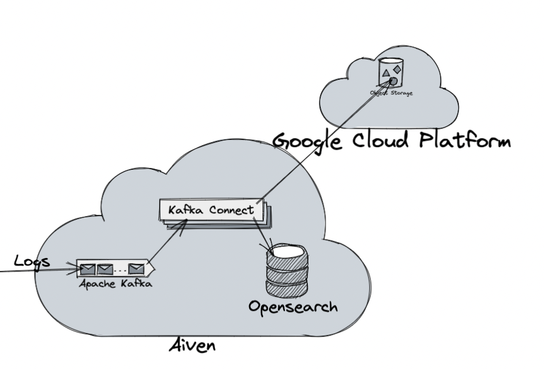

# Long Term Logging with Aiven for OpenSearch and Aiven for Apache Kafka

This example uses Aiven for Apache Kafka as a logging source (in this example, it is a source for itself but you can use something like Filebeat as well).
It is intended to cover the use cases where logging volumes are growing exponentially as you scale. For example, you may be working in an industry where compliance regulations require log retention for 7 years but, for your own observability, you rarely require logs older than 14 days. Storing all 7 years of logs, even with hot/cold indexes, can become financially problematic or require you to use more resources than you would typically need for your log storage engine.

We are using OpenSearch here but, in most cases, this is interchangeable with the last Open Source release of Elasticsearch (7.11)

Using Apache Kafka, one can push logs through the message queues and utilise the Kafka ecosystem (Kafka Connect, primarily) to store logs in multiple destinations. This provides redundancy, as well as cost benefits.

Here is the flow of what we will do here:
1. Deploy Aiven for Apache Kafka with Kafka Connect support enabled
2. Create a `Logging` Service Integration that will allow Kafka to log to a topic within the cluster
3. Deploy Aiven for OpenSearch and create an Index Pattern for the logging format we will use (one new index per day).
4. Configure Aiven for OpenSearch to only hold the last 14 indices and delete older ones so that we do not have to monitor our index count or manually clean them up.
5. Configure the Google Cloud Storage Sink Connector to log to a bucket in our Google Cloud
6. Configure the OpenSearch Sink Connector to log to a daily index in our Aiven for OpenSearch
7. Deploy a Google Cloud Function that can take the name of a log file (and OpenSearch credentials) and restore the file to an index we specify

## Setup

We will be using the following services:

- Aiven Platform (API Key Needed)
- Aiven for Apache Kafka
- Aiven for Apache Kafka Connect
  - OpenSearch Sink Connector
  - Google Cloud Storage Sink Connector
- Aiven for OpenSearch

You will need:
- The credentials for your Google Cloud Storage account saved (as `gcreds.json`) inside the `terraform` folder
- Use the `secrets.tfvars.example` to create `secrets.tfvars` with your Aiven API token, project and service names

## Running

### Terraform

1. `cd terraform`
2. `terraform init`
3. `terraform plan --var-file=secrets.tfvars`
4. `terraform apply --var-file=secrets.tfvars`

### Google Cloud Functions

1. Zip the `google_cloud_function_restore` directory
2. Navigate to `Functions` at [console.cloud.google.com](https://console.cloud.google.com)
3. Create a new function, set HTTP as the trigger and provide the zip file as the source
4. Use the `testing` tab to send an example request