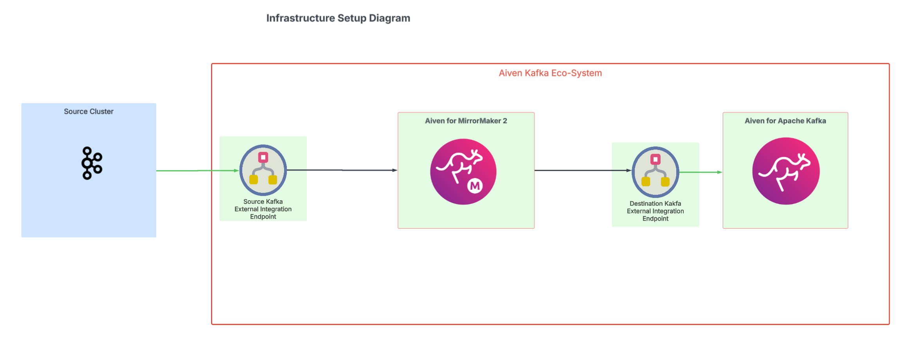
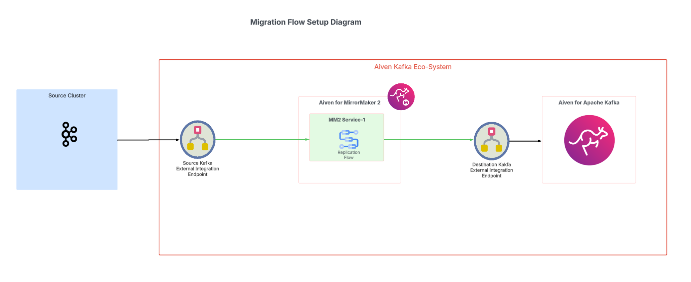

# Overview
The repo is a migration accelerator to get facilitate migrating external Kafka clusters onto an Aiven Kafka Cluster. 

# Table of Contents
1. Discovery
2. Infrastructure setup
3. Migration Replicaiton setup
4. Observability setup
5. Consumer validation

--------------------------------

# Discovery
When migrating an existing kafka cluster to Aiven, 
To get an detailed report of the current source system navigate to /source-cluster-discovery-utility 

* For Aiven source clusters create a client.properties file  and include `--command-config <client.properties path>` into the broker specific commands
* Update broker information where `<BOOTSTRAP-SERVER>:<PORT>` 
* run `sh source-kafka-discovery.sh`

# Infrastructure Setup
To set up the new Aiven Kafka and MirrorMaker 2 (mm2) clusters, navigate to /infra-integration-setup

The infrastructure setup will create a destination kafka cluster, a MirrorMaker2 service, and at least one external endpoint for the source kafka cluster and one external endpoint for the new destination kafka cluster. 
* Each replication flow created in the migration flow step will require its own endpoint so this can be scaled out. 

To run terraform:
`terraform init 
 terraform apply`

 **Required Information for infrasture setup**
 1. Aiven API Token
 2. project name
 3. service name prefix
 4. Destination kafka cloud name
 5. MirrorMaker2 plan name
 6.  Source cluster uri
 7. source kafka cluster name
 8. destination kafka cluster name

# Migration Flow setup
Now that the services for the migration are spun up, the mirror maker service gets setup to replicate the source Kafka cluster information on the new Destination kafka cluster.

**Required Information for infrasture setup**
1. Aiven API Token
2. Aiven project name
3. source kafka service name
4. destination kafka service name
5. source kafka external endpoint id
6. destination kafka external endpoint id
7. MirrorMaker2 service name

* To get external endpoint Ids, you can run `avn service integration-endpoint-list --project <project name>` in the Aiven CLI
Multiple migration flows can be spun up to migrate groups of topics in parallel.

# Observability Setup
Once the migration of data starts, spinning up the observability solution will allow service monitoring in the interem. 

# Consumer Validation
Goal/Outcome : Offset sync tool inspects source and target cluster and compares the consumer group states. The tool emits the result as CSV.
more information found in the [ReadMe here](./mm2-offset-consumer-groups-validation/README.md). 
