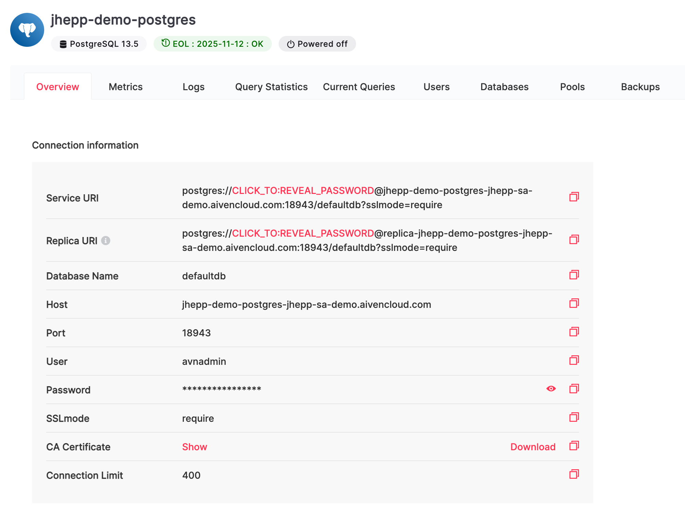

# Aiven Configuration for Temporal.io Integration

[Aiven](https://aiven.io/) is a fully managed, open source cloud data platform that works for you.  
Aiven makes setting up cloud databases so simple anyone can do it. Our set-it-and-forget-it solutions 
take the pain out of cloud data infrastructure. 

Temporal is a distributed, scalable, durable, and highly available orchestration engine designed to 
execute asynchronous long-running business logic in a resilient way.

This repo contains the configuration for connecting Temporal Server to several of Aiven's database
offerings including Postgres, MySQL, Cassandra and Opensearch.

Use this repository with configuration examples in conjunction with the Temporal [helm-chart](https://github.com/temporalio/helm-charts)
examples to get a fully functioning system with HA persistence setup up and running in minutes! 

# High level logical steps to get up and running
These are the logical steps to complete to get a functioning prototype.
1. Sign up for an Aiven [free trial](https://console.aiven.io/signup) account.  
2. Depending on what persistence database you would like to use, start either a Postgres, MySQL, Cassandra 
and an optional Opensearch service.
3. Update the appropriate `values.aiven.<service>.yaml` file with the correct configuration for the new Aiven service.
4. Follow the Temporal instructions for setting up temporal server in a Kubernetes cluster. 
5. Start the temporal server in the Kubernetes cluster using the Aiven supplied credentials.
6. Verify that data is flowing

# Sign up for an Aiven free trial account
Simply sign up for an Aiven [free trial](https://console.aiven.io/signup) account.
The following [video](https://www.youtube.com/watch?v=-pVqQAE6LBE) will help guide you through the 
console and setting up your first service.

# Start an Aiven database
Temporal allows for 3 persistence options as well as an optional Elasticsearch layer for logs integration.
Elasticsearch has been rebranded as Opensearch and is maintained by the open source communities.

The following links will help you set up the Aiven database that you would like to plug into your Temporal Server
for durable persistence.
* General Aiven Help located [here](https://developer.aiven.io/).
* Getting started with [Cassandra](https://help.aiven.io/en/articles/1803299-getting-started-with-aiven-for-cassandra).
* Getting started with [Postgres](https://developer.aiven.io/docs/products/postgresql/getting-started.html).
* Getting started with [MySQL](https://developer.aiven.io/docs/products/mysql/get-started.html).
* Getting started with [Opensearch](https://developer.aiven.io/docs/products/opensearch/index.html).

# Update Temporal config file with Aiven service info
Once the Aiven service is up and running, you will need to gather information from the overview page.  
As an example, the following screen shows the overview tab for an Aiven Postgres server. 
Gather the following information and update the correct `values.aiven.<service>.yaml` file in all appropriate places.

* Host --> Update all <host> values in `values.aiven.<service>.yaml`.
* Port --> Update all port values in `values.aiven.<service>.yaml`.
* User --> User all should already be set to `avnadmin` by default.
* Password --> Update all <password> values in `values.aiven.<service>.yaml`.
* CA Certificate"
  * Download the CA Certificate file, note the download location.  
  Example: `/aiven_ca_certs/aiven.<service>.ca.cer`
  * Execute the following command to base64 encode the file.   
  `base64 /aiven_ca_certs/aiven.<service>.ca.cer > /aiven_ca_certs/aiven.<service>.ca.cer.base64`
  * Take the full path to the base64 encoded file and update the `caData` value in `values.aiven.<service>.yaml`.
  * **Note**: Opensearch does not require `caData` configure.



# Install Temporal service on a Kubernetes cluster

From the Temporal [helm-chart](https://github.com/temporalio/helm-charts) repository follow these sections:

1. Prerequisites
2. Download Helm Chart Dependencies

The Temporal doc describes how to "Bring Your Own" service to plug into Temporal Server.  We are going to substitute 
Aiven services and the following sections of this document describe how to start Temporal Server configured to point
at an Aiven service that is running.

## Bring your own Aiven Postgres
To point Temporal at the Aiven Postgres database, we will need to create and configure temporal
databases on the Aiven Postgres service with `temporal-sql-tool`. The tool is part of
[temporal repo](https://github.com/temporalio/temporal), and it relies on the schema definition, in the same repo.

Here are examples of commands you can use to create and initialize the databases:

```bash
# in https://github.com/temporalio/temporal git repo dir
export SQL_PLUGIN=mysql
export SQL_HOST=<host>
export SQL_PORT=<port>
export SQL_USER=avnadmin
export SQL_PASSWORD=<password>
export SQL_TLS_CA_FILE=/aiven_ca_certs/aiven.postgres.ca.cer

./temporal-sql-tool --tls create-database -database temporal
SQL_DATABASE=temporal ./temporal-sql-tool --tls setup-schema -v 0.0
SQL_DATABASE=temporal ./temporal-sql-tool --tls update -schema-dir schema/postgresql/v96/temporal/versioned

./temporal-sql-tool --tls create-database -database temporal_visibility
SQL_DATABASE=temporal_visibility ./temporal-sql-tool --tls setup-schema -v 0.0
SQL_DATABASE=temporal_visibility ./temporal-sql-tool --tls update -schema-dir schema/postgresql/v96/visibility/versioned
```

Once you initialized the two databases, use the `values.aiven.postgres.yaml` with the proper configuration set
(see above for details) and start the Temporal server pointing at the Aiven Postgres Service.

```bash
# in https://github.com/temporalio/helm-charts git repo dir
helm install temporaltest \
	-f <path>/values.aiven.postgres.yaml \
	--set elasticsearch.enabled=false \
	--set grafana.enabled=false \
	--set prometheus.enabled=false \
	--set server.replicaCount=1 \
	. --timeout 15m --wait
```
Please see the Aiven Postgres Help guide from above for how to connect to the service to validate the databases
are installed correctly.

## Bring your own Aiven Cassandra

To point Temporal at the Aiven Cassandra database, we will need to create and configure temporal
keyspaces on the Aiven Cassandra service with `temporal-cassandra-tool`. The tool is part of
[temporal repo](https://github.com/temporalio/temporal), and it relies on the schema definition, in the same repo.

Here are examples of commands you can use to create and initialize the keyspaces:

```bash
# in https://github.com/temporalio/temporal git repo dir
export CASSANDRA_HOST=<host>
export CASSANDRA_PORT=<port>
export CASSANDRA_USER=avnadmin
export CASSANDRA_PASSWORD=<password>
export CASSANDRA_ENABLE_TLS=true
export CASSANDRA_TLS_CA=/aiven_ca_certs/aiven.cassandra.ca.cer

./temporal-cassandra-tool create-Keyspace -k temporal
CASSANDRA_KEYSPACE=temporal ./temporal-cassandra-tool setup-schema -v 0.0
CASSANDRA_KEYSPACE=temporal ./temporal-cassandra-tool update -schema-dir schema/cassandra/temporal/versioned

./temporal-cassandra-tool create-Keyspace -k temporal_visibility
CASSANDRA_KEYSPACE=temporal_visibility ./temporal-cassandra-tool setup-schema  -v 1.0
CASSANDRA_KEYSPACE=temporal_visibility ./temporal-cassandra-tool update -schema-dir schema/cassandra/visibility/versioned

```

Once you initialized the two databases, use the `values.aiven.cassandra.yaml` with the proper configuration set
(see above for details) and start the Temporal server pointing at the Aiven Cassandra Service.

```bash
# in https://github.com/temporalio/helm-charts git repo dir
helm install temporaltest \
	-f <path>/values.aiven.cassandra.yaml \
	--set elasticsearch.enabled=false \
	--set grafana.enabled=false \
	--set prometheus.enabled=false \
	--set server.replicaCount=1 \
	. --timeout 15m --wait
```

Please see the Aiven Cassandra Help guide from above for how to connect to the service to validate the keyspaces
are installed correctly.

## Bring your own Aiven MySQL

To point Temporal at the Aiven MySQL database, we will need to create and configure temporal 
databases on the Aiven MySQL service with `temporal-sql-tool`. The tool is part of 
[temporal repo](https://github.com/temporalio/temporal), and it relies on the schema definition, in the same repo.

Here are examples of commands you can use to create and initialize the databases:

```bash
# in https://github.com/temporalio/temporal git repo dir
export SQL_PLUGIN=mysql
export SQL_HOST=<host>
export SQL_PORT=<port>
export SQL_USER=avnadmin
export SQL_PASSWORD=<password>

./temporal-sql-tool create-database -database temporal
SQL_DATABASE=temporal ./temporal-sql-tool setup-schema -v 0.0
SQL_DATABASE=temporal ./temporal-sql-tool update -schema-dir schema/mysql/v57/temporal/versioned

./temporal-sql-tool create-database -database temporal_visibility
SQL_DATABASE=temporal_visibility ./temporal-sql-tool setup-schema -v 0.0
SQL_DATABASE=temporal_visibility ./temporal-sql-tool update -schema-dir schema/mysql/v57/visibility/versioned
```

Once you initialized the two databases, use the `values.aiven.mysql.yaml` with the proper configuration set 
(see above for details) and start the Temporal server pointing at the Aiven MySQL Service.

```bash
# in https://github.com/temporalio/helm-charts git repo dir
helm install temporaltest \
	-f <path>/values.aiven.mysql.yaml \
	--set elasticsearch.enabled=false \
	--set grafana.enabled=false \
	--set prometheus.enabled=false \
	--set server.replicaCount=1 \
	. --timeout 15m --wait
```
Please see the Aiven MySQL Help guide from above for how to connect to the service to validate the databases
are installed correctly.

## Bring your own Aiven Opensearch

Adding Opensearch as an optional sidecar is easy by simply adding the following parameter to any of the prior
launch scripts for Postgres, Cassandra or MySQL.

`-f values.aiven.opensearch.yaml ` and ensuring that you remove the `--set elasticsearch.enabled=false` overriding line.

Please see the Aiven Opensearch Help guide from above for how to connect to the service to validate the indexes
are created correctly.

# Verify Temporal is Running Properly

Now that temporal is up and running and pointing at an Aiven database, the following is an example list of the 
k8s pods that will be started and configured to point at Aiven.

You can use your favorite kubernetes tools ([k9s](https://github.com/derailed/k9s),
[kubectl](https://kubernetes.io/docs/tasks/tools/install-kubectl/), etc.) to interact with your cluster.

```
$ kubectl get pods
NAME                                           READY   STATUS    RESTARTS   AGE
temporaltest-admintools-6cdf56b869-xdxz2       1/1     Running   0          11m
temporaltest-frontend-5d5b6d9c59-v9g5j         1/1     Running   2          11m
temporaltest-history-64b9ddbc4b-bwk6j          1/1     Running   2          11m
temporaltest-matching-c8887ddc4-jnzg2          1/1     Running   2          11m
temporaltest-web-77f68bff76-ndkzf              1/1     Running   0          11m
temporaltest-worker-7c9d68f4cf-8tzfw           1/1     Running   2          11m
```
## Port Forwarding
Ensure that port forwarding is setup for both the `frontend` and `web` pods to allow access for the CLI and for a browser.

* Port Forward `frontend` [steps](https://github.com/temporalio/helm-charts#forwarding-your-machines-local-port-to-temporal-frontend)
  allowing for [Temporal CLI](https://docs.temporal.io/docs/devtools/tctl/) access.
* Port Forward `web` [steps](https://github.com/temporalio/helm-charts#forwarding-your-machines-local-port-to-temporal-web-ui) and then access [http://127.0.0.1:8088](http://127.0.0.1:8088).

## Setup `Default` Namespace using Temporal CLI From the Admin Tools Container

Install the Temporal CLI `tctl` following these [instructions](https://docs.temporal.io/docs/devtools/tctl/). Once 
installed execute the following to set up the default namespace. 
```bash
tctl --ns default n re
tctl namespace list
```

# Testing and Verification

Follow the Temporal [run-your-first-app-tutorial](https://docs.temporal.io/docs/java/run-your-first-app-tutorial) to test and validate
that your Temporal Server is properly working and successfully integrated with Aiven services.

## Uninstalling

Note: in this example chart, uninstalling a Temporal instance also removes all the data that might have been created during its  lifetime.

```bash
~/temporal-helm $ helm uninstall temporaltest
```
Sometimes a pod would get stuck and the following command was helpful to fully clear them.  
```
kubectl delete -n default job temporaltest-schema-setup
```

For the Aiven Service, simply power off the service.  All data will be persisted upon termination and restored upon restart.

